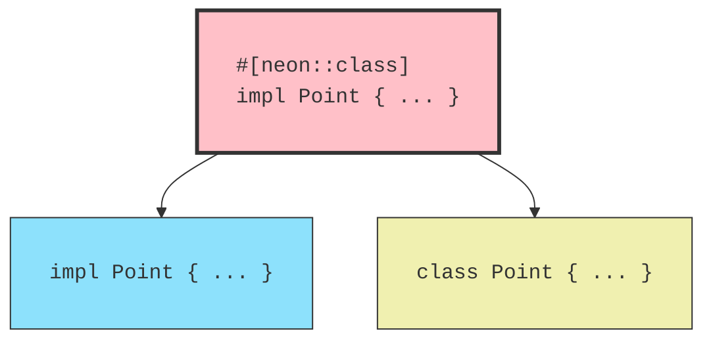

- intro section
  - I just implemented class syntax in [Neon](https://neon-rs.dev), a library I maintain with [K.J. Valencik](https://github.com/kjvalencik) for embedding Rust code in Node.js.
  - It was a fun challenge to make expressing classes that work in both languages nevertheless feel natural and idiomatic in both contexts
  - I'm happy with how it came out
  - example class definition:
```rust
#[derive(Debug, Clone)]
pub struct Point {
    x: u32,
    y: u32,
}

#[neon::class]
impl Point {
    pub fn new(x: u32, y: u32) -> Self {
        Self { x, y }
    }

    pub fn x(&self) -> u32 {
        self.x
    }

    pub fn y(&self) -> u32 {
        self.y
    }

    pub fn distance(&self, other: &Self) -> f64 {
        let dx = (self.x as i32 - other.x as i32).pow(2);
        let dy = (self.y as i32 - other.y as i32).pow(2);
        ((dx + dy) as f64).sqrt()
    }
}
```
  - example class usage:
```javascript
const { Point } = addon;

const source = new Point(0, 0);
const dest = new Point(3, 4);

console.log(source.distance(dest)) // 5
```
- implementation section
  - The implementation was fun, too
  - The cool thing about a macro is we can give one syntax for generating code in both languages
  - diagram:

  - This builds on K.J.'s earlier work on the [`#[neon::extract]` macro](https://docs.rs/neon/latest/neon/attr.export.html) and powerful [conversion traits](https://docs.rs/neon/latest/neon/types/extract/index.html#traits)
  - The key trick of the macro is to generate custom JavaScript source code to run at class initialization time
  - Using the `Point` example, the JS class initialization looks something like this:
```javascript
(function makeClass(wrap, xMethod, yMethod, distanceMethod) {
  class Point {
    constructor(x, y) {
      wrap(this, x, y); // wrap `this` around Rust struct
    }
  }

  const prototype = Point.prototype;

  prototype.x = xMethod;
  prototype.y = yMethod;
  prototype.distance = distanceMethod;

  return Point;
})
```
  - The class initialization logic calls [`neon::reflect::eval`](https://docs.rs/neon/latest/neon/reflect/fn.eval.html) with that generated source string to create the `makeClass` function, which it then calls with the Rust implementations of the methods
```rust
const CLASS_MAKER_SCRIPT = #r"
(function makeClass(wrap, nxMethod, yMethod, distanceMethod) {
  // etc ...
})
";
let src = cx.string(CLASS_MAKER_SCRIPT);
let make_class = neon::reflect::eval(cx, src)?.downcast::<JsFunction>(cx).or_throw(cx)?;
let wrap = JsFunction::new(cx, |mut cx| { /* ... */ });
let constructor: Handle<JsFunction> = make_class
  .bind(cx)
  .args(wrap, x, y, distance)?
  .call()?;
```
  - The `wrap` function is the last bit of glue, which takes the pure JS object in the `Point` constructor and attaches the Rust struct to it:
```rust
let wrap = JsFunction::new(cx, |mut cx| {
    let this = cx.this();
    let (x: u32, y: u32) = cx.args()?;
    let instance = Point::new(x, y);
    neon::object::wrap(&mut cx, this, RefCell::new(instance))?.or_throw(&mut cx)?;
    Ok(cx.undefined())
});
```
